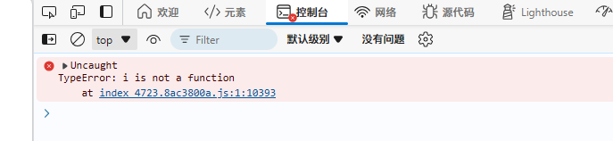
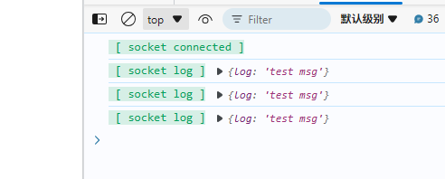

### 复现步骤：

1、运行`pnpm build`打包客户端代码

2、运行`pnpm build-server`打包服务端代码，然后`pnpm start-server`开启服务器

3、点击终端打印的 `http://localhost:8888/` 打开网页，打开控制台等几秒钟，就会出现报错：

4、如果是`pnpm dev`在开发模式下，控制台正常输出：

5、把 core 版本换成`1.2.8`，再`pnpm build`打包，再打开`http://localhost:8888/`，控制台输出也是正常的
